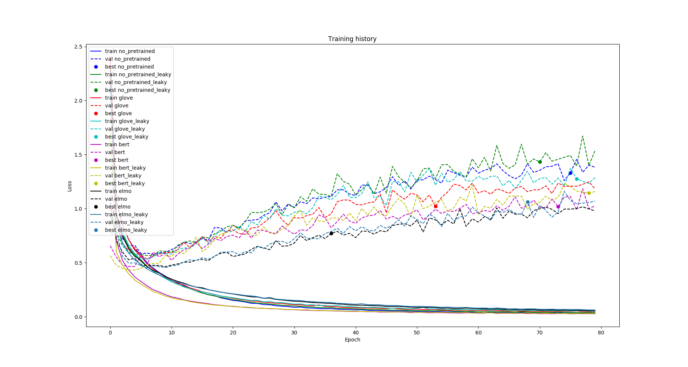

# Dependency-Parsing-Dozat
This is a set of AllenNLP configs to reproduce the dependency parcer from this [paper](https://arxiv.org/pdf/1611.01734.pdf)  
Experiments were done with different embeddings (GLOVE, ELMO, BERT) and activation functions(ELU, Leaky RELU).

The experiments have shown that ELU activation allows models to converge faster without loose of quality in contrast to leaky ReLU.
# References
Follow the original article repo https://github.com/zysite/biaffine-parser  
Look at the AllenNLP implementation https://github.com/allenai/allennlp/blob/master/allennlp/models/biaffine_dependency_parser.py  
Dataset was taken from https://universaldependencies.org/  
AllenNLP model https://allennlp.org/models#dependency-parsing
